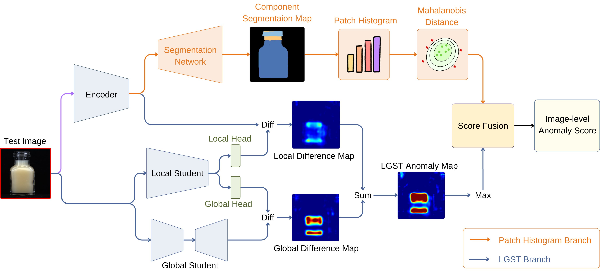
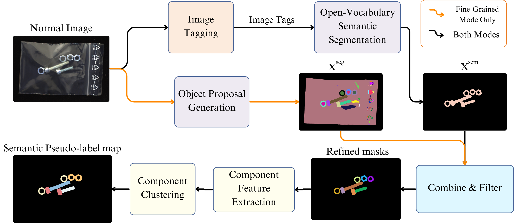

# CSAD: Unsupervised Component Segmentation for Logical Anomaly Detection
 [](https://arxiv.org/abs/2408.15628) 
[](https://paperswithcode.com/sota/anomaly-detection-on-mvtec-loco-ad?p=csad-unsupervised-component-segmentation-for)


This is the official implementation of the paper "CSAD: Unsupervised Component Segmentation for Logical Anomaly Detection" accepted by BMVC 2024.
### (0919) Update: CSAD now supports TensorRT!
### (0911) Update: CSAD now supports ONNX, OpenVINO and TFLite!

## Model Architecture


CSAD consists of two branches: a Patch Histogram branch that detects anomalies using component segmentation and an LGST branch that detects both small and large-scale anomalies.

## Unsupervised Semantic Pseudo-label Generation


Proposed semantic pseudo-label generation that generates semantic pseudo-labels from normal images only using multiple foundation models.

## Patch Histogram


An example illustrating the effectiveness of patch histograms in addressing
position-related logical anomalies.

## Speed-performance Comparison


The speed-performance plot on the
MVTec LOCO AD benchmark. 

## Setup Environment
We use python==3.10 with pytorch==2.4.1(cuda12.1)

To install HQ-SAM, follow the instruction in https://github.com/SysCV/sam-hq and download the checkpoint into `ckpt/`.

To install Grounding-dino, follow the instruction in https://github.com/IDEA-Research/GroundingDINO and download the checkpoint into `ckpt/`.

To install other denpendency:
```
pip install -r requirements.txt
```

## Dataset
Download the [MVTec LOCO AD](https://www.mvtec.com/company/research/datasets/mvtec-loco) dataset to the `datasets/`, result should be like `datasets/mvtec_loco_anomaly_detection/{category}` for each category.

## Semantic Pseudo-label Generation
Download the generated semantic pseudo-label maps from [GoogleDrive](https://drive.google.com/file/d/16C2C_Zitl04lnb07giXI30X0HK2TPKDA/view?usp=sharing) and extract into `datasets/`.

Or you can generate by runing 
```
python pseudo_label.py
```

The result images are stored in the `datasets/masks/`. Where `all_masks.png` stores masks generated by SAM, `grounding_mask.png` stores masks generated by Grounded-SAM and `filtered_cluster_map.png` is the semantic pseudo-label map.

## Training Component Segmentation Network
Run 
```
train_segmentor.py
```
and segmentation result of the test set is stored in `datasets/masks/<category>/test_seg_output`. Model will be saved in `ckpt/segmentor_{category}_{resolution}.pth`.
Anomaly scores will be saved in `anomaly_score/{category}_patchhist_logi_score.npy`, `anomaly_score/{category}_patchhist_struc_score.npy` and `anomaly_score/{category}_patchhist_val_score.npy`.

## Training the LGST
Run
```
python CSAD.py
```
Model will be saved in the `ckpt/best_{category}.pth`, anomaly scores will be saved in `anomaly_score/{category}_CSAD_logi_score.npy`, `anomaly_score/{category}_CSAD_struc_score.npy` and `anomaly_score/{category}_CSAD_val_score.npy`.

## Evaluation

Detection results of MVTec LOCO AD:
| Source | Total Average AUROC  | 
|-|-|
| Paper | 95.3 |   
| pytorch | 95.671 |
|ONNX| 95.693 |
|OpenVINO| 95.676 |
|TFLite|95.687|
|TensorRT|95.671|

### 1. Evaluate pretrained models
Download the pretrained Pytorch model from [Google drive](https://drive.google.com/file/d/1ZvzjT62hOqFNkEPAHpREk0mVe7DviXAF/view?usp=sharing), extract files into `ckpt/pytorch_models` and run:

```
python export_model.py --inference_only --format torch
```
The detection result will show in the cmd.

### 2. Export modules to Pytorch model
Make sure you have the following files:

```
ckpt/best_{category}.pth
ckpt/segmentor_{category}_256.pth
anomaly_score/{category}_patchhist_params.npz
anomaly_score/{category}_LGST_val_score.npy
anomaly_score/{category}_patchhist_val_score.npy
```

and run
```
python export_model.py --format torch
```
to convert all module into a single Pytorch model stored in `ckpt/pytorch_models/{category}.pth`.

### 3. Convert Pytorch model to ONNX format
Make sure you have the following files:

```
ckpt/pytorch_models/{category}.pth
```

and run
```
python export_model.py --format onnx
```
to convert pytorch model to ONNX model stored in `ckpt/onnx_models/{category}.onnx`.

### 4. Convert ONNX model to OpenVINO format
Make sure you have the following files:

```
ckpt/onnx_models/{category}.onnx
```

and run
```
python export_model.py --format openvino
```
to convert ONNX model to OpenVINO model stored in `ckpt/openvino_models/{category}.bin` and `ckpt/openvino_models/{category}.xml`.

### 5. Convert Pytorch model to TFLite format
Install ai_edge_torch follow the instructions in [ai_edge_torch](https://github.com/google-ai-edge/ai-edge-torch).</br>
Make sure you have the following files:

```
ckpt/pytorch_models/{category}.pth
```

and run
```
python export_model.py --format tflite
```
to convert Pytorch model to TFLite model stored in `ckpt/tflite_models/{category}.tflite`.

### 6. Convert ONNX model to TensorRT format
Install TensorRT(10.4.0) with cuda version 12.4 follow the instructions in [NVIDIA](https://docs.nvidia.com/deeplearning/tensorrt/install-guide/index.html).</br>
We will use `trtexec` in the TensorRT to convert the model.<br>
Make sure you have the following files:

```
ckpt/onnx_models/{category}.onnx
```
and run
```
python export_model.py --format tensorrt
```
to convert Pytorch model to TensorRT model stored in `ckpt/trt_models/{category}.engine`.


### 7. Evaluate in ONNX or OpenVINO or TFLite or TensorRT format
After obtaining the models, you can evaluate them with
```
python export_model.py --inference_only --format onnx
or
python export_model.py --inference_only --format openvino
or
python export_model.py --inference_only --format tflite
or
python export_model.py --inference_only --format tensorrt
```
The detection result will show in the cmd.<br>

Note that 
+ inference of ONNX model requires onnxruntime/onnxruntime-gpu package.
+ inference of TensorRT model requires pycuda package.


### 8. Alternative way to evaluate model
After training all modules, make sure you have the following files:

```
anomaly_score/{category}_patchhist_logi_score.npy
anomaly_score/{category}_patchhist_struc_score.npy
anomaly_score/{category}_patchhist_val_score.npy
anomaly_score/{category}_LGST_logi_score.npy
anomaly_score/{category}_LGST_struc_score.npy
anomaly_score/{category}_LGST_val_score.npy
```

and run 
```
python benchmark_performance.py
```
and the test results are stored in `score_combine_result.txt`, given in seperated or combined setting.

### Notes
1. Similar to EfficientAD, we enable padding in both local and global students while disabling them in the speed testing section, for both settings produce similar detection result.

# Acknowledgments
We adopt some of the code from [EfficientAD](https://github.com/nelson1425/EfficientAD/tree/main), [anomalib](https://github.com/openvinotoolkit/anomalib) and [Grounded-SAM](https://github.com/IDEA-Research/Grounded-Segment-Anything/tree/main), thanks for their great work.

# Citation
If you find CSAD useful in your research, please star ⭐ this repository and consider citing
```
@misc{hsieh2024csad,
      title={CSAD: Unsupervised Component Segmentation for Logical Anomaly Detection}, 
      author={Yu-Hsuan Hsieh and Shang-Hong Lai},
      year={2024},
      eprint={2408.15628},
      archivePrefix={arXiv},
      primaryClass={cs.CV},
      url={https://arxiv.org/abs/2408.15628}, 
}
```
